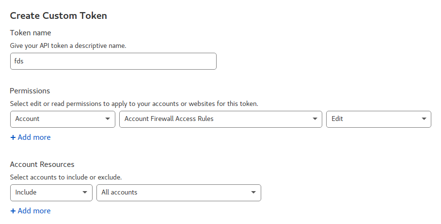

# Cloudflare integration

`fds` is capable of working with FirewallD and Cloudflare at the same time.

This means that blocking IP address or networks propagates to both FirewallD and Cloudflare, thus allowing you to
prevent more malicious connections.

The Cloudflare firewall allows only blocking single IP addresses and specific network ranges.
`fds` will automatically convert and chunk networks to appropriate subnets for Cloudflare.

So with `fds` you can easily block, e.g. 114.119.128.0/18 on Cloudflare.
It is smart enough to chunk that
to [multiple /24 networks](http://jodies.de/ipcalc?host=114.119.128.0&mask1=18&mask2=24).
You cannot easily do that with Cloudflare's own interface!

## Enable Cloudflare integration

To set up `fds` to use Cloudflare integration, all you need is a Cloudflare token.

Log in to your Cloudflare account, then proceed to [API Tokens](https://dash.cloudflare.com/profile/api-tokens) page.
In "Permissions" section, ensure "Account", "Account Firewall Access" permission, set to "Edit".
By default, `fds` adds blocks to all accounts it has access to via the token created.
So if you have multiple accounts, and you want `fds` to operate only on specific one, choose the desired account in
the "Account" section.

*Above: Creating Cloudflare token for `fds`*

Once the token is created, copy it to clipboard, then run in your Terminal: `fds config`.
Paste it in the token when prompted. Done. Cloudflare integration is enabled.

Now, any time you run `fds block 1.2.3.4`, the blocking will be done in both FirewallD and in Cloudflare.
Specifically, the blocks in Cloudflare are added under Firewall->Tools under every domain in the account.

The same applies to blocking countries. The only gotcha there is that Free Cloudflare accounts are not
eligible for country blocking as is. `fds` detects a free account and adds Captcha challenge for blocked
countries, to at least somehow circumvent the free account's limitations.

